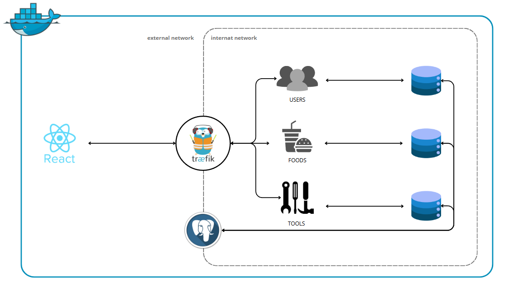

# MY cooking workflow

## Introduction

Cette application web a été conçue pour vous aider à gérer vos **plans de repas** et vos **recettes** de manière efficace. Elle offre une multitude de fonctionnalités pour simplifier votre quotidien en cuisine :

* **Todolist intégrée** pour organiser vos plans de repas hebdomadaires.
* **Calcul automatique** des quantités d'ingrédients nécessaires pour vos recettes.
* **Génération de listes de courses** basées sur vos recettes et plans de repas.
* **Gestion complète de vos recettes** : ajoutez, modifiez ou supprimez-les facilement.
* **Recherche de recettes** par ingrédients ou mots-clés.
* **Suggestions de recettes personnalisées** basées sur vos critères, votre historique et votre inventaire.

---

## Architecture de l'application

Voici une vue d'ensemble de l'architecture des services de l'application :



---

## Installation

Pour lancer l'application, suivez ces étapes :

1. **Clonez le dépôt Git** :

   **Bash**

   ```
   git clone https://github.com/votre-utilisateur/votre-depot.git
   ```

   (Remplacez `https://github.com/votre-utilisateur/votre-depot.git` par l'URL réelle de votre dépôt.)
2. **Créez un fichier `.env`** à la racine du projet (au même niveau que le fichier `docker-compose.yml`). Ce fichier contiendra toutes les variables d'environnement nécessaires au bon fonctionnement de l'application. Voici un exemple de contenu, que vous devrez adapter à vos besoins :

   ```
   FRONTEND_PORT=8000
   PG_USER=myuser
   PG_PASS=mypassword
   PG_MCW_USERS_DB=mcw_users_db
   PG_MCW_TOOLS_DB=mcw_tools_db
   PG_MCW_FOOD_DB=mcw_food_db
   PG_USERS_PORT=5433
   PG_TOOLS_PORT=5434
   PG_FOOD_PORT=5435
   PGADMIN_PORT=8081
   PGADMIN_DEFAULT_EMAIL=admin@example.com
   PGADMIN_DEFAULT_PASSWORD=adminpassword
   API_USERS_PORT=3001
   API_FOOD_PORT=3002
   API_TOOLS_PORT=3003
   ```

   **Pensez à bien personnaliser** les valeurs, notamment les mots de passe et les numéros de port, pour des raisons de sécurité et pour éviter les conflits.
3. **Lancez l'application** avec Docker Compose :

   **Bash**

   ```
   docker compose up --build
   ```

   Cette commande va construire les images Docker nécessaires et démarrer tous les services définis dans votre `docker-compose.yml`.

Utilisation
Une fois l'application démarrée, vous pouvez accéder aux différents services via les URL suivantes (en supposant les ports par défaut ou ceux spécifiés dans l'exemple de .env) :

Application Front-end (My Cooking Workflow) :
http://localhost:3000 (ou le port que vous avez défini pour FRONTEND_PORT)

Tableau de bord Traefik :
http://localhost:8080

API des utilisateurs (mcw-users) :
http://mcw-users.localhost

API de la nourriture (mcw-food) :
http://mcw-food.localhost

API des outils (mcw-tools) :
http://mcw-tools.localhost

pgAdmin (interface de gestion PostgreSQL) :
http://localhost:8081 (ou le port que vous avez défini pour PGADMIN_PORT)
